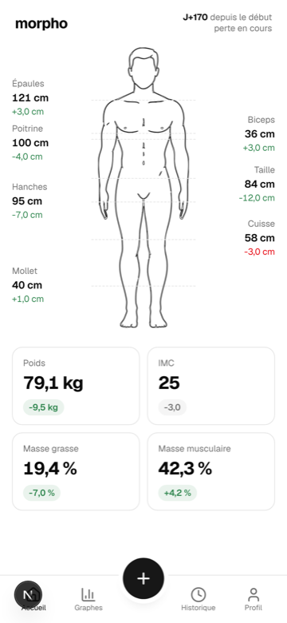
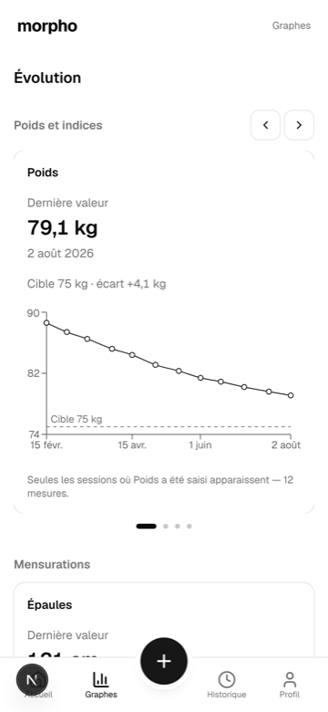
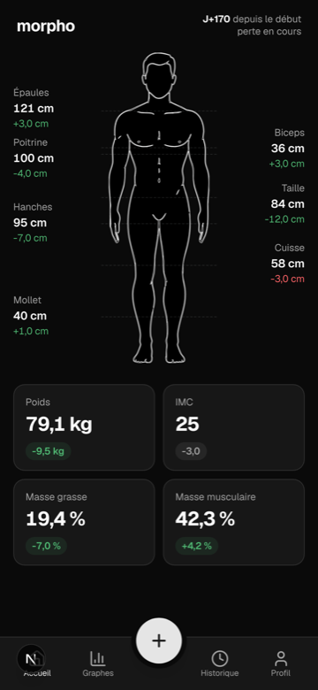
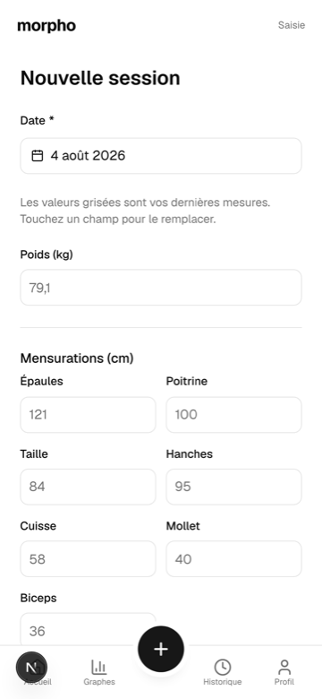
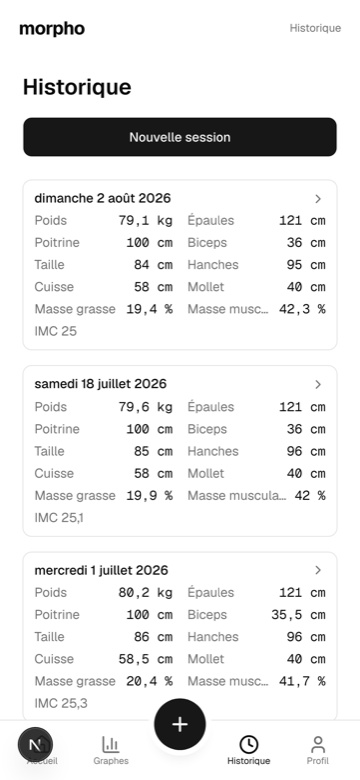
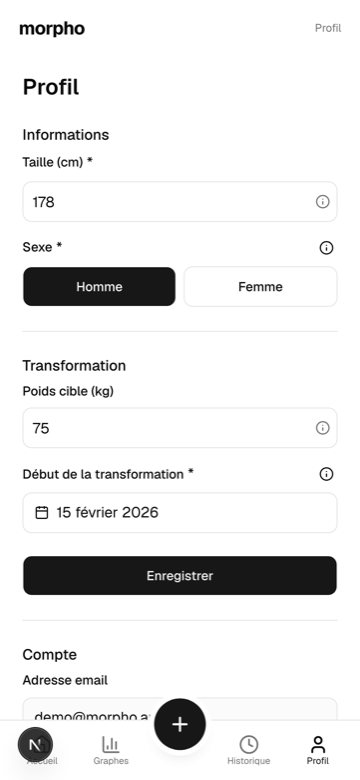

<div align="center">

# morpho

**Track your body, not just your weight.**

A self-hosted PWA that turns a bathroom-scale number and a tape measure into a
readable picture of your transformation — a body map, deltas since day one, and
charts that actually answer "is this working?".

[](https://github.com/oliviermattei/morpho/actions/workflows/ci.yml)
[](./LICENSE)
[](https://nextjs.org)
[](https://neon.tech)
[](./docs/decisions/007-pwa-serwist-turbopack.md)





<br>

<a href="https://buymeacoffee.com/oliviermattei" target="_blank"></a>

<em>Free &amp; open source. If it saves you time, you can <a href="https://buymeacoffee.com/oliviermattei">buy me a coffee</a> ☕ — every little bit helps and keeps the project going.</em>

</div>

---

## Why morpho

Scales lie. Two months into a recomposition the number barely moves while the
waist drops 6 cm and the shoulders gain 3 — and every mainstream tracker shows
you a flat line and calls it a plateau.

morpho tracks **ten measurements** per session (weight, 7 circumferences, body
fat %, muscle %), draws them on a silhouette, and puts the delta since your
starting point next to every single one. It is a one-person app you run on your
own database: no account farm, no ads, no data resale, no "premium" wall in
front of your own numbers.

**Screenshots use fictional demo data.** No real measurements are published in
this repository.

## Features

- **Body map home screen** — a hand-drawn silhouette (male/female) annotated
  with your latest value per zone and the delta since day one, green or red
  depending on which direction is favourable *for that measurement*.
- **Stat cards** — weight, BMI, body fat and muscle mass, each with its own
  trend chip. Missing measurements read "aucune mesure", never `0`.
- **Charts** — per-metric evolution with your target weight drawn as a
  reference line and the gap spelled out, powered by Recharts.
- **History** — every session, editable and deletable, with a detail view.
- **Fast entry** — one screen, ten optional fields; fill what you measured
  today and nothing else.
- **Targets & onboarding** — height, sex and transformation start date drive
  BMI, the silhouette, and the "J+170 since the start" header.
- **Installable PWA** — installs to the home screen, works offline, and purges
  its cache on sign-out so a shared device leaks nothing.
- **Dark mode**, French UI, mobile-first (designed at 375 px, scales up).

| Entry | History | Profile |
|---|---|---|
|  |  |  |

## Stack

| Layer | Choice |
|---|---|
| Framework | Next.js 16 (App Router, Turbopack), React 19, TypeScript strict |
| UI | Tailwind v4, shadcn/ui (radix base, radix-nova preset), lucide |
| Data | Neon Postgres via Drizzle ORM |
| Auth | Neon Auth — email + password |
| Charts | Recharts |
| PWA | Serwist (`@serwist/turbopack`) |
| Validation | Zod, on the server for every payload |
| Tests | Vitest + Testing Library (unit), Playwright (e2e), PGlite (test DB) |

Every choice is written up in [`docs/decisions/`](./docs/decisions) — 20 ADRs
explaining not just what was picked but what it cost.

## Getting started

### Prerequisites

- **Node 20+**
- A **Neon** project (free tier is plenty) with **Neon Auth** enabled

### Install

```bash
git clone https://github.com/oliviermattei/morpho.git
cd morpho
npm install
cp .env.example .env.local
```

Fill `.env.local`:

```bash
DATABASE_URL=            # Neon connection string (pooled)
NEON_AUTH_BASE_URL=      # Neon Auth server URL for your project
NEON_AUTH_COOKIE_SECRET= # 32+ random chars, e.g. `openssl rand -base64 32`
```

None of these may ever be prefixed with `NEXT_PUBLIC_` — the browser never
talks to Postgres, by design.

### Run

```bash
npm run db:migrate   # apply the SQL migrations in drizzle/
npm run dev          # http://localhost:3000
```

Create an account on `/auth/sign-in`, complete onboarding (height, sex, start
date), and log your first session.

### Checks

```bash
npm run check        # typecheck + eslint + vitest — exactly what CI runs
npm run test:e2e     # Playwright (npx playwright install once)
```

Set `E2E_EMAIL` / `E2E_PASSWORD` in `.env.local` (a real account on your Neon
Auth project) to also run the session-dependent specs — see
[ADR 019](./docs/decisions/019-email-password-replaces-magic-link.md).

### Deploy

[](https://vercel.com/new/clone?repository-url=https%3A%2F%2Fgithub.com%2Foliviermattei%2Fmorpho&env=DATABASE_URL,NEON_AUTH_BASE_URL,NEON_AUTH_COOKIE_SECRET)

One Vercel project, one Neon project, the three env vars above. Migrations run
from your machine with `npm run db:migrate`.

## How it's built

```
docs/          product & engineering trail: prd, stories, architecture, ADRs, plans, reviews
drizzle/       generated SQL migrations — versioned, never hand-edited
src/app/       routes, layouts, route handlers (api/)
src/components/    app components · ui/ = generated shadcn primitives
src/lib/       db/ (Neon client + schema) · auth · onboarding · measurements
public/silhouettes/  homme.svg, femme.svg — the drawing behind the home screen
tests/e2e/     Playwright specs
```

Four rules the codebase refuses to bend on:

1. **The browser never talks to Postgres.** Every read and write goes through a
   Server Component or a route handler.
2. **Identity comes from the session**, never from a `user_id` in a payload. A
   handler that trusts a client-sent identifier is a security bug.
3. **Empty is not zero.** An unfilled field produces no row — it never becomes
   `0` and never pollutes a delta or a chart axis.
4. **No hard-coded colors.** Everything comes from the design tokens in
   `src/app/globals.css`.

Start with [`docs/architecture.md`](./docs/architecture.md) for the full
picture, or [`docs/design-system.md`](./docs/design-system.md) for the UI rules.

## Privacy

Your measurements live in **your** Neon database and nowhere else. There is no
analytics, no third-party script, no telemetry. Signing out purges the service
worker cache so nothing readable stays on a shared device
([ADR 018](./docs/decisions/018-sw-cache-purged-on-signout.md)).

## Contributing

Contributions are welcome — bug reports, ideas, docs fixes and code alike.
Read the [contributing guide](./CONTRIBUTING.md) first: this repo is built
through a spec-first pipeline (`docs/prd.md` → `docs/stories.md` →
`docs/plans/<id>.md` → code), and knowing that up front saves you a rewrite.
Please also note our [Code of Conduct](./CODE_OF_CONDUCT.md), and report
security issues privately per [SECURITY.md](./SECURITY.md).

Ideas that would land well: silhouette variants, extra measurement kinds, CSV
export, i18n (the UI is French-only today).

## License

[MIT](./LICENSE) © Olivier Mattei

<div align="center">
<br>
<a href="https://buymeacoffee.com/oliviermattei" target="_blank"></a>
</div>
